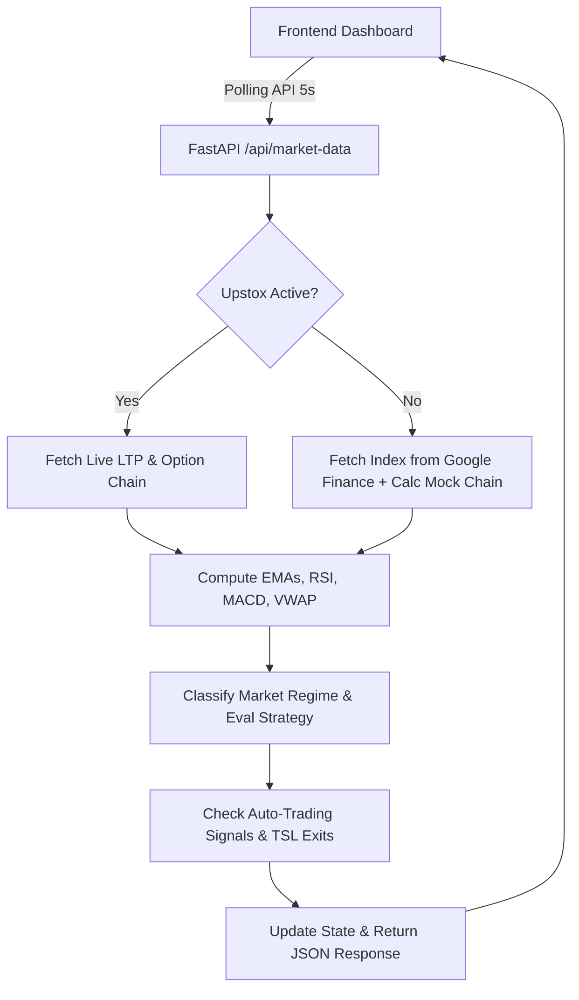

# Project Context — Nifty AI Dashboard

## Project Overview & Purpose
The Nifty AI Dashboard is a web-based automated and manual options trading cockpit designed for Indian Index markets (primarily Nifty and Sensex). It serves two main functions:
1. **Market Intelligence & Decision Engine**: Evaluates technical indicators (EMA, RSI, ADX, MACD, Supertrend, VWAP, PCR, Advance-Decline, Sector Breadth) in real-time to classify the market regime (e.g., strong trend, range-bound) and recommend optimal option trading strategies.
2. **Execution System**: Integrates with the Upstox API for real-time market data feed and live order execution. Supports both "Paper" (simulated) and "Live" trading modes, with built-in capital protection (2% max loss auto-exit) and trailing stop-loss (TSL) mechanisms.

## Technologies & Stack
- **Backend Framework**: Python FastAPI (REST APIs, static file routing, JSON database file synchronization).
- **Frontend**: Vanilla HTML5, CSS3, and JavaScript (ES6+). Includes Chart.js for intraday index chart plotting.
- **Data Scrapers**: Fallback Google Finance scraper for live Nifty/Sensex index prices when Upstox integration is inactive.
- **Option Pricing**: Black-Scholes-Merton Greek calculations (Delta, Theta, Vega) implemented in native Python.

## Directory & Folder Structure
```
├── .antigravity.md              # Permanent AI development instructions
├── app.py                       # FastAPI application & State Engine
├── settings.json                # Persisted dashboard settings
├── journal.json                 # Chronological trade logs (database file)
├── requirements.txt             # Python packages (fastapi, uvicorn, requests, pydantic)
├── start.sh                     # Launch script for development server
├── start_with_tunnel.sh         # Launch script with localhost.run secure tunnel
├── docs/                        # Project documentation folder
│   ├── PROJECT_CONTEXT.md       # High-level overview, modules, structure
│   ├── ARCHITECTURE.md          # Multi-timeframe flows & execution pipelines
│   ├── TRADING_RULES.md         # Capital limits, risk boundaries & lot calculations
│   ├── API_SPEC.md              # REST API schema and endpoint documentation
│   ├── TODO.md                  # Features and backlog (v1.1, v1.2)
│   └── CHANGELOG.md             # Version history and release notes
└── static/                      # Web interface files
    ├── index.html               # Main dashboard UI
    ├── login.html               # Administrative login page
    ├── script.js                # Core polling, state synchronization & rendering
    ├── style.css                # Custom dashboard stylesheets
    ├── chart.umd.js             # Local Chart.js library
    └── chartjs-plugin-annotation.js # Local Chart.js annotation plugin
```

## Main Modules & Core Classes

### 1. `SimulationState` (in `app.py`)
Maintains the running runtime state of the market, including:
- Spot index price, change value, change percentage.
- Technical indicators calculated dynamically (EMA, RSI, MACD, VWAP).
- Multi-timeframe candle aggregations (1m, 5m, 15m).
- Option chain arrays (either fetched from Upstox API or mock-priced using Black-Scholes).
- Live parameters (active trade ID, daily closed P&L, stop-limit state).
- Dashboard settings (loaded from `settings.json`).

### 2. `TradeJournal` (in `app.py`)
Handles trade persistence, logging, and performance metrics:
- Real-time save and load to/from `journal.json`.
- Tracking of open/closed status, entries, exits, option legs, and exact P&L.
- Analytics generation (win/loss ratios, average win/loss, profit factor, drawdown).

## Important Configuration Files
- **[settings.json](file://settings.json)**: Persists user-defined state such as `capital`, `risk_pct`, `auto_trade_mode`, index preference, trailing SL, and Upstox API credentials.
- **[journal.json](file://journal.json)**: Serves as the localized JSON database for all historical and active trades.

## Data Flow


## Current Version
- **Current Version**: `v1.0.0`
- **Previous Version**: N/A

## Future Roadmap (v1.1.0 & Beyond)
- Version 1.1: Standardized lot sizing, trading hours restrictions, signal stabilization cooldown, brokerage estimation, separate booked vs live P&L display.
- Version 1.2: Multi-timeframe (MTF) option buy logic integration.
